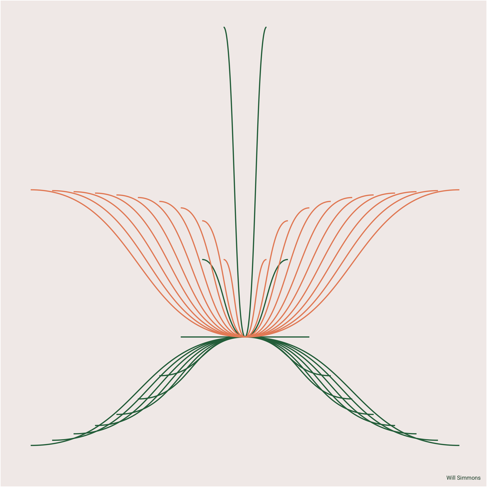
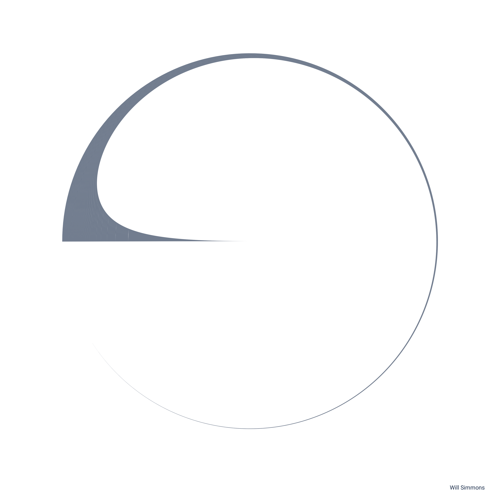

## *(attempts at) generative art*

 

 
 
 

Initial inspiration (and much better art) found in Ijeamaka Anyene's [*Radial Patterns in `ggplot2`*](https://ijeamaka-anyene.netlify.app/posts/2021-01-04-radial-patterns-in-ggplot2/).